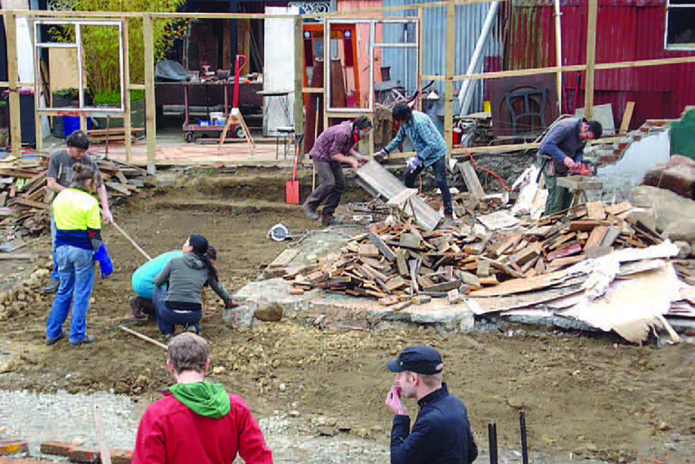
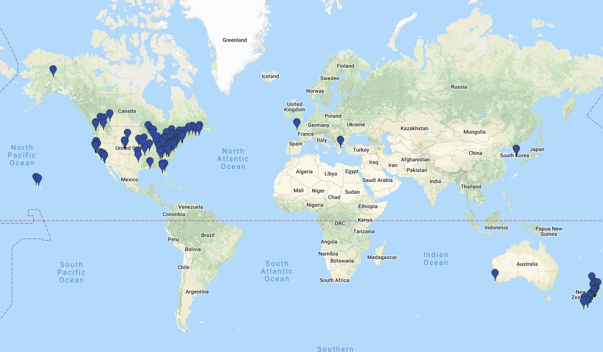
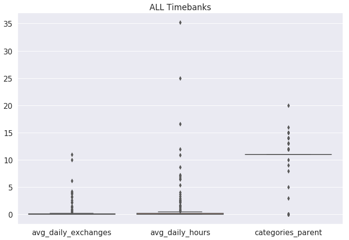
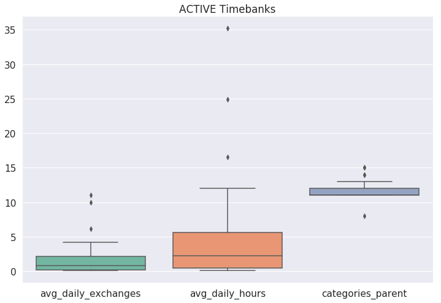
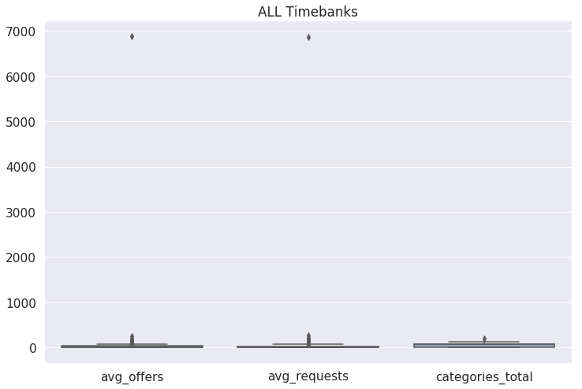
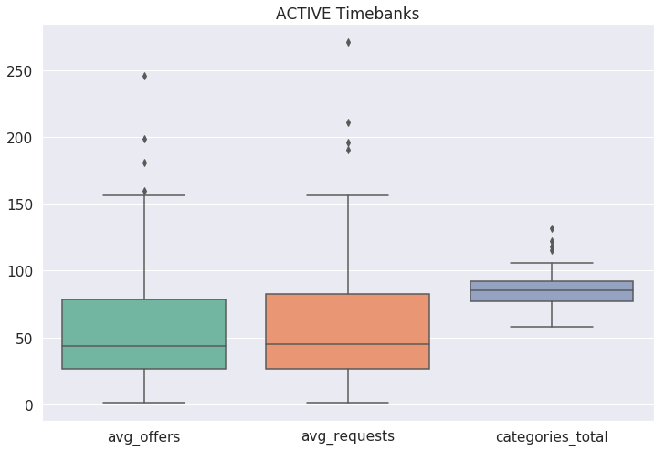
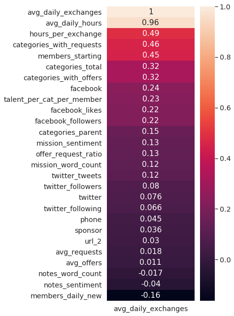
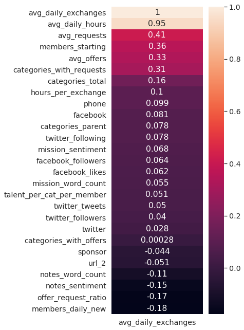

# Timebanks
> Author: [Dawn Graham](https://dawngraham.github.io/)

## Problem Statement
Timebanking can help individual and community needs be met without relying on money, markets, or the state. What are the best predictors of an active timebank?

## Goal
To build a regression model to identify the best predictors of the average number of daily exchanges in timebanks on the TimeBanks.org platform.

## Background
As explained on the [TimeBanks USA](https://timebanks.org/) website: "Timebanking is a time-based currency. Give one hour of service to another, and receive one time credit." The site goes on to list the five core values of timebanking identified by Edgar Cahn, the founder of the organization: 

- **Asset**: Every one of us has something of value to share with someone else.
- **Redefining Work**: There are some forms of work that money will not easily pay for, like building strong families, revitalizing neighborhoods, making democracy work, advancing social justice. Time credits were designed to reward, recognize and honor that work.
- **Reciprocity**: The question: “How can I help you?” needs to change so we ask: “Will you help someone too?” Paying it forward ensures that, together, we help each other build the world we all will live in.
- **Community/Social Networks**: Helping each other, we reweave communities of support, strength & trust. Community is built by sinking roots, building trust, creating networks. 
- **Respect**: The heart and soul of democracy lies in respect for others. We strive to respect where people are in the moment, not where we hope they will be at some future point.

Currently in the U.S., many people are concerned about seemingly increasing social and political division. Meanwhile, people are still dealing with the effects of the longest government shutdown in U.S. history, with another potential shutdown ahead. Timebanks offer the possibility of strengthening ties within communities, (re)building trust and relationships, and creating support systems to help meet daily needs and recover from crises (political, natural, or otherwise).

  
*Community members organize using resources provided by the Lyttelton Time Bank after the Canterbury earthquakes in New Zealand (Source: [Developing Local Partners in Emergency Planning and Management](https://ir.canterbury.ac.nz/handle/10092/8208))*

## Data Collection
This project is focused on data from TimeBanks USA. While there are other platforms with more timebanks listed (such as [hOurworld](http://hourworld.org/) and [Community Exchange System](https://www.community-exchange.org)), they do not have as much centralized and publicly accessible information about individual timebanks.  

I created a [Directory Scraper](/notebooks/01_tb_scrape_directory.ipynb) to scrape all pages of the TimeBanks.org directory to get an initial listing of all timebanks on the platform. I then created a [Daily Scraper](/notebooks/02_tb_daily_scraper.ipynb) to get updates on the following at the beginning of each day:

- Numbers for exchanges, hours, members, offers, requests, last exchange
- Offers, requests, and talents by category
- All offer and request listings

I manually gathered data from Facebook and Twitter accounts that were included on timebank pages. This decision was originally prompted by Facebook's restrictions on automated data collection. However, this became an opportunity to learn more about the different timebanks and was feasible given the relatively small number of timebanks with social media accounts.

Geolocation and census data for locations of U.S. timebanks was compiled using [Geocodio](https://www.geocod.io/). I gathered population estimates for New Zealand from [Stats NZ](https://www.stats.govt.nz/). These will be used for future developments with the project.

See the [Data README.md](/data/README.md) for a description of all data files included in this repo, as well as the data dictionary for the features and target used in modeling.

*Map of timebanks on TimeBanks USA (Source: [TimeBanks USA Directory](http://community.timebanks.org/))*

## Processing & Feature Engineering
See the [Cleaning & Feature Engineering notebook](/notebooks/03_tb_cleaning_engineering.ipynb) for full details. In this notebook, I generate new features and combine collected data into a single file to use for modeling.

I got compound sentiment scores (using VADER's `SentimentIntensityAnalyzer`) and word counts for each timebank's mission statement and notes. Dummy variables indicate if each timebank has a phone number, sponsor, secondary website, Facebook account, or Twitter account listed. I also calculated the averages for the number of daily exchanges, number of hours exchanged each day, hours per exchange, number of offers, number of requests, ratio of offers to requests, and number of new members each day. Additional features included the number of parent categories for each timebank, total categories (parent and child), the percent of categories with offers and requests, and total talents per parent category per member.

## Exploratory Data Analysis
Working on this project has been a highly iterative process. I used exploratory data analysis throughout data collection, processing, feature engineering, etc. The [EDA notebook](/notebooks/04_tb_eda.ipynb) contains analysis and visualization of the combined data that will be used for modeling. This includes a look at data for ALL timebanks compared to INACTIVE and ACTIVE timebanks. From this, I anticipated that creating separate models for all timebanks and active timebanks would provide helpful insights.

| |  |
|---|---|
| |  |
|
**Correlation Heatmap for ALL Timebanks** 
 | 
**Correlation Heatmap for ACTIVE Timebanks** 
 |

## Modeling
I created separate models for all timebanks and active timebanks only. Using `GridSearchCV` to find the best parameters, I tried models using `LinearRegression`, `RidgeCV`, `LassoCV`, `ElasticNetCV`, and `DecisionTreeRegressor`. Ultimately, I selected linear regression with backward feature selection as the best model for both.

The [Modeling notebook](./notebooks/05_tb_modeling.ipynb) contains instructions and code to reproduce the models. The [Modeling Results notebook](./notebooks/06_tb_modeling_results.ipynb) contains summaries of many attempted models, including their metrics.

#### Model for ALL Timebanks
The best model for ALL timebanks explained 54.3% of the variability in the data, relative to a model with no predictors. The model predicted that the average number of daily exchanges would increase with:

- more requests
- fewer offers
- more hours per exchange
- a phone number being listed
- higher word count for notes

#### Model for ACTIVE Timebanks only 
The best model for ACTIVE timebanks explained 39.8% of the variability in the data, relative to a model with no predictors. The model predicted that the average number of daily exchanges would increase with:

- fewer Facebook likes
- more Facebook followers
- more requests
- fewer offers
- a sponsor being listed

## Summary
Considering both the relatively small number of timebanks in this data set (156 total, 48 active) and how much they differ from each other, I was not expecting to get very robust models. However, they do still provide useful insights into differences between active and inactive timebanks, as well as potential predictors of more exchanges among active timebanks. I am hopeful that adding data about the communities the timebanks are based in will strengthen the models and provide more insights into what makes an active timebank.

See the [Process Log](./process_log.md) for additional documentation of my process, challenges, questions, ideas, and references.

## Future Developments
This project is very much a work in progress. Future developments include:

- Collecting updated directory info regularly to gather new timebank info.
- Doing time series analysis of listings once more data over a longer period of time is collected.
- Using natural language processing to take a deeper dive into what requests and offers are exchanged, what goes unmet, and other patterns.
- Deeper look at language use, framing, descriptiveness, and active/passive voice in mission statements and other timebank info.
- Investigating if areas with more timebanks in closer proximity also have more activity.
- Looking at demographic info in relation to timebank locations, including population size and density, unemployment rates, home ownership, etc.
- Setting up the daily scraper to run automatically via AWS.

## An Invitation
Thoughts and feedback are always appreciated. Please feel free to get in touch. Get up-to-date contact info at [dawngraham.github.io](https://dawngraham.github.io/).